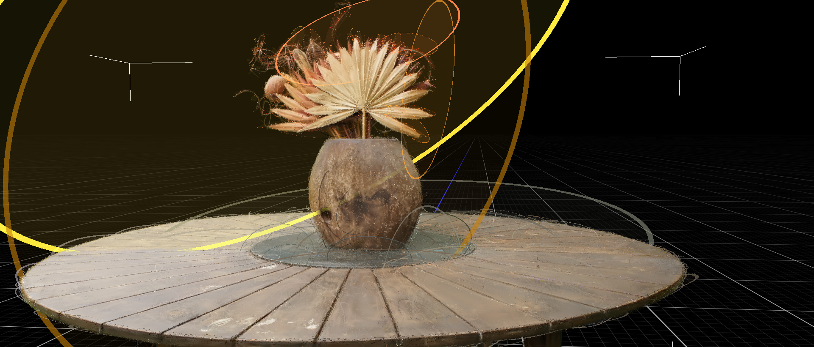
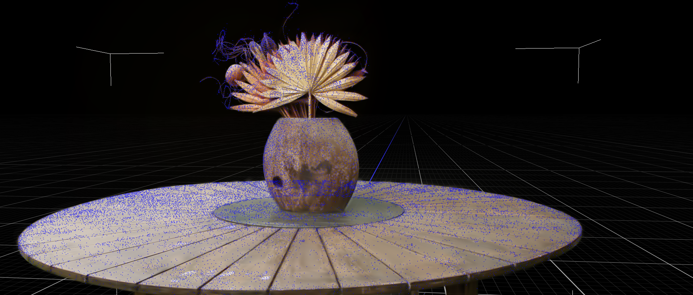

# SVR-GS  
### *Spatially Variant Regularization for Probabilistic Masks in 3D Gaussian Splatting*  

🎥 Side-by-side comparisons between rendered videos of our method **(SVR-GS)** and the baseline **(MaskGS)** are available through the official **ICRA** submission website.

---

## 🖼️ Visual Comparisons  
> 🔎 *Tip:* Click any image to open it at full resolution.

<table>
  <thead>
    <tr>
      <th><b>Rendered Image</b></th>
      <th><b>Overlaid Gaussians</b></th>
      <th><b>Overlaid Points</b></th>
    </tr>
  </thead>
  <tbody>
    <tr>
      <td align="center">
        
         
        <i>Rendered image from an arbitrary novel view.</i>
      </td>
      <td align="center">
        
         
        <i>Each ellipse is the image-space footprint of a projected <b>3D Gaussian</b> (projected covariance contour). At full resolution, many small ellipses appear on fine structures (e.g., leaves, table surface).</i>
      </td>
      <td align="center">
        
         
        <i>Blue points mark the <b>projected means</b> (image-plane centers) of the 3D Gaussians. Denser clusters indicate higher Gaussian population in those regions.</i>
      </td>
    </tr>
  </tbody>
</table>

---

## 📚 Math Proofs  
For the mathematical derivations supporting the forward-design ablations, see the **[Math Proofs](https://github.com/personanonymousperson54-a11y/anonymous-3dgs-supplementary/tree/main/math_proof)** page.

---

## 🎬 Demo

<video src="images/demo.mp4" controls playsinline style="max-width:100%; width:720px; height:auto;">
  Your browser does not support embedded videos. You can download and watch it
  <a href="images/demo.mp4">here</a>.
</video>

